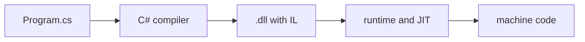

# Deep dive: What is .NET?

Optional and not graded. Feel free to leave.

---

# What is installed on your machine

```bash
dotnet --list-sdks
dotnet --list-runtimes
```

The SDK is what you need to write programs: the C# compiler, the `dotnet` commands and the project templates. It also contains a runtime.

The runtime is what you need to run them. A machine that only runs .NET programs, such as a server, can have the runtime without the SDK.

`net10.0` in the `.csproj` means the program needs runtime 10 to run.

---

# From source code to a running program



The compiler does not produce machine code. It produces IL (intermediate language), a set of instructions that is the same on every processor. The runtime translates IL into machine code for the processor it runs on, one method at a time, the first time the method is called. The part that does this is the JIT (just-in-time) compiler.

---

# What the build produces

```bash
cd labs/01-intro/code/UnderTheHood
dotnet build -c Release
ls -l bin/Release/net10.0
```

```text
124712  UnderTheHood                    native launcher for this OS
  5632  UnderTheHood.dll                your code, as IL
 11928  UnderTheHood.pdb                debug information
   330  UnderTheHood.runtimeconfig.json which runtime to load
   408  UnderTheHood.deps.json          dependencies
```

Your program is the 5 KB `.dll`. You can run it with `dotnet bin/Release/net10.0/UnderTheHood.dll`, or through the launcher next to it.

---

# Which runtime to load

`UnderTheHood.runtimeconfig.json`:

```json
{
  "runtimeOptions": {
    "tfm": "net10.0",
    "framework": {
      "name": "Microsoft.NETCore.App",
      "version": "10.0.0"
    }
  }
}
```

When you start the program, `dotnet` reads this file and looks for runtime 10.0.0 or a newer patch of it, such as 10.0.2.

---

# Where `Main` went

<<< @/code/UnderTheHood/Program.cs#entry cs

```text
Entry point: Program.<Main>$
```

With top-level statements the compiler still creates a class and a `Main` method. It names the method `<Main>$`, which is not a valid C# name, so it can never clash with a method you write.

---

# IL is just bytes

<<< @/code/UnderTheHood/Program.cs#calculator cs

<<< @/code/UnderTheHood/Program.cs#il cs

```text
IL of Add: 0203582A
```

The whole method `Add` is four bytes of IL.

---

# Reading the four bytes

| Byte | Instruction | Meaning |
|---|---|---|
| `02` | `ldarg.0` | push argument `a` on the stack |
| `03` | `ldarg.1` | push argument `b` on the stack |
| `58` | `add` | pop two values, push their sum |
| `2A` | `ret` | return the value on top of the stack |

IL works like a stack machine. It knows nothing about registers or processors.

---

# Watching the JIT

The runtime can report every method it compiles. Set an environment variable and run the program:

```bash
DOTNET_JitDisasmSummary=1 ./bin/Release/net10.0/UnderTheHood | grep -E "Main|Calculator"
```

```text
1: JIT compiled Program:<Main>$(System.String[]) [Instrumented Tier0, IL size=210, code size=980]
4: JIT compiled Calculator:Add(long,long) [Tier0, IL size=4, code size=36]
5: JIT compiled Program:<Main>$(System.String[]) [Tier1-OSR @0x9f ..., code size=2276]
6: JIT compiled Calculator:Add(long,long) [Instrumented Tier0, IL size=4, code size=36]
7: JIT compiled Calculator:Add(long,long) [Tier1, IL size=4, code size=20]
```

`Add` was compiled three times.

<!--
Run the program itself, not `dotnet run`: the `dotnet` command is also a .NET program and would print its own methods too.
The loop calls Add 100 million times so the runtime has a reason to optimize it.
-->

---

# Tiered compilation

The first time a method is called, the JIT compiles it quickly and without optimizations (Tier0), so the program starts fast.

The runtime counts the calls. When a method is called often, the JIT compiles it again, this time optimized (Tier1). In between, an instrumented version collects data about how the method is used.

`Main` runs only once but contains a long loop, so the runtime replaces it while it is running. That is the `OSR` (on-stack replacement) line.

---
layout: two-cols-header
---

# Tier0 and Tier1

```bash
DOTNET_JitDisasm='Calculator:Add' ./bin/Release/net10.0/UnderTheHood
```

::left::

Tier0, 36 bytes:

```text
stp  fp, lr, [sp, #-0x20]!
mov  fp, sp
str  x0, [fp, #0x18]
str  x1, [fp, #0x10]
ldr  x0, [fp, #0x18]
ldr  x1, [fp, #0x10]
add  x0, x0, x1
ldp  fp, lr, [sp], #0x20
ret  lr
```

::right::

<div class="pl-6">

Tier1, 20 bytes:

```text
stp  fp, lr, [sp, #-0x10]!
mov  fp, sp
add  x0, x0, x1
ldp  fp, lr, [sp], #0x10
ret  lr
```

Tier0 copies `a` and `b` to memory and reads them back. Tier1 adds the two registers directly.

</div>

---

# Same IL, different machine code

The listing on the previous slide comes from an ARM64 processor (a Mac). The lab computers use x64 processors, so the same command prints different instructions there.

The `.dll` is identical on both. Only the JIT output changes, which is why you can copy a .NET program from Windows to Linux or macOS and run it, as long as the runtime is installed.

Try it on the lab computer:

```bash
DOTNET_JitDisasm='Calculator:Add' ./bin/Release/net10.0/UnderTheHood
```

---

# In the browser

[sharplab.io](https://sharplab.io) shows the same steps for any code you type: the C# the compiler really sees, the IL, and the JIT output. Nothing to install.

Next deep dive: value types, reference types and what happens in memory when you pass them around.
